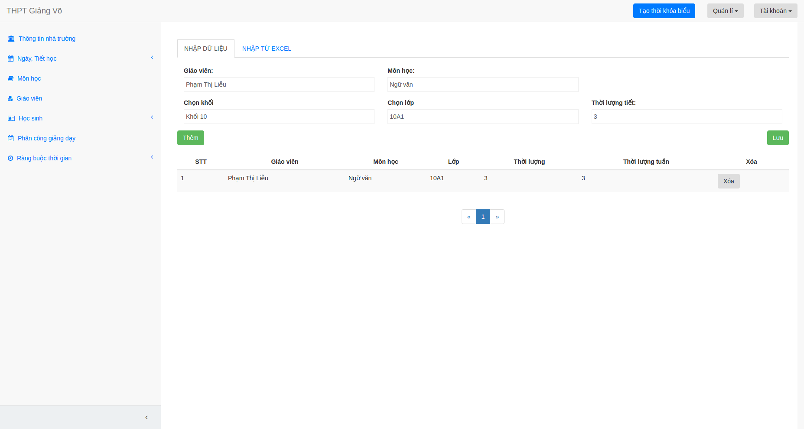
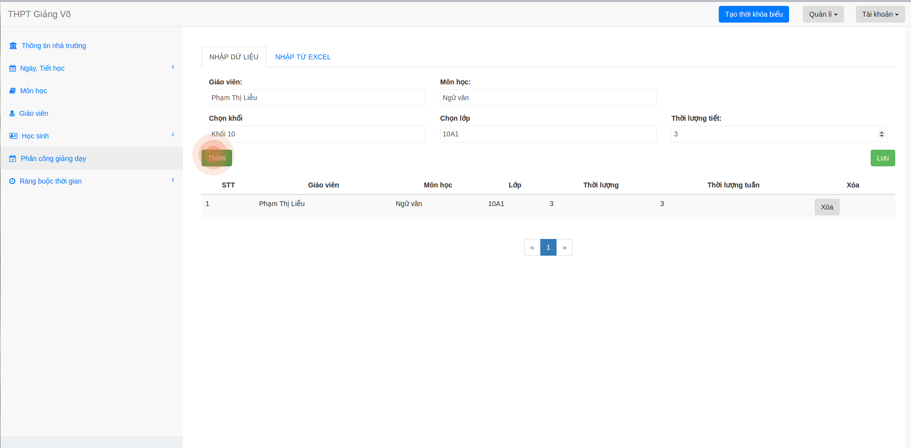
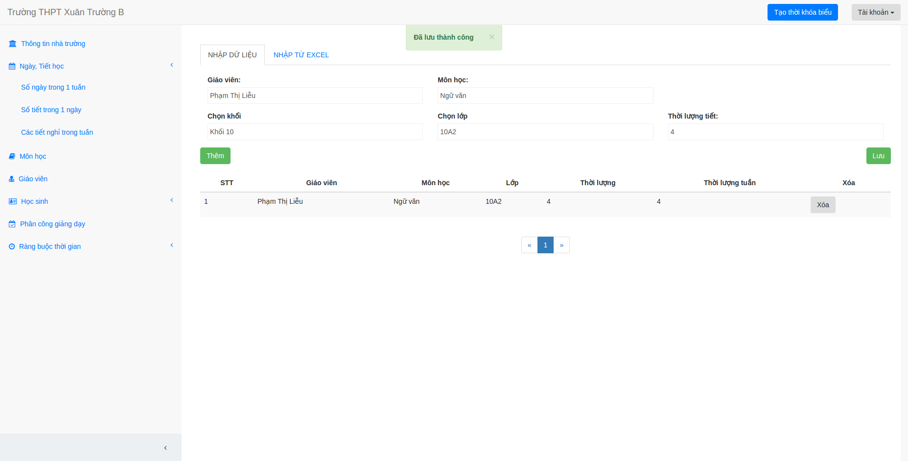
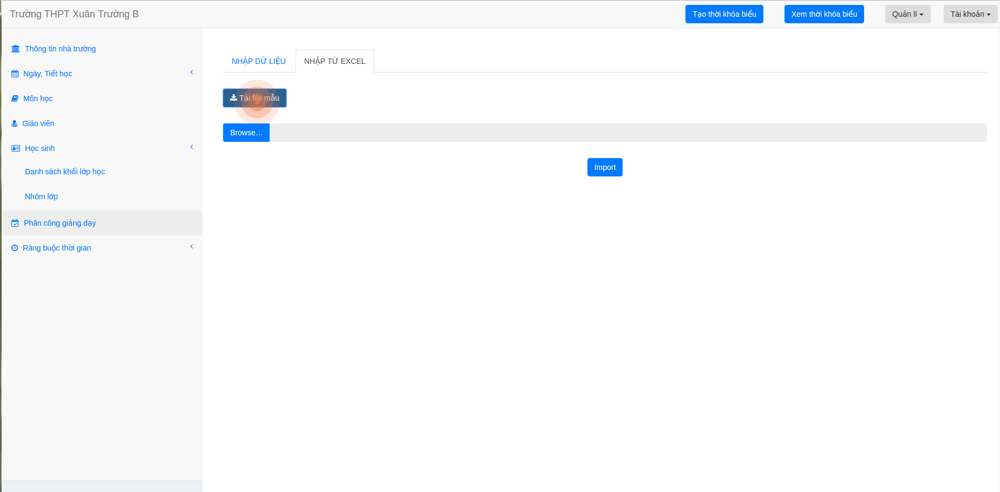

## Phân công giảng dạy

Có 2 cách để bạn nhập phân công giảng dạy:

1. Nhập trực tiếp trên website

2. Tải lên file excel chứa phân công giảng dạy theo mẫu trên website.

## Cách 1: Nhập trực tiếp

1. Bạn chọn mục "Phân công giảng dạy"

2. Bạn nhập nhập đầy đủ các thông tin về tiết giảng.

3. Bấm thêm.

4. Sau khi thêm đủ các tiết giảng bạn bấm lưu để lưu dữ liệu. Bạn có thể bấm lưu bất cứ lúc nào !

## Cách 2: Nhập từ file excel

1. Bạn chọn mục "Phân công giảng dạy"

2. Nếu bạn chưa biết chuẩn để nhập vào file excel, bạn chọn bấm tải file mẫu.

3. Bạn nhập tạo 1 file excel, nhập dữ liệu theo mẫu đã tải.
4. Chọn "Browse ...", chọn file excel đã nhâp dữ liệu để tải lên.
5. Bấm Import.
