## Ràng buộc các tiết bận của giáo viên

1. Chọn "Ràng buộc thời gian" -> "Giáo viên" -> "Các tiết bận"

2. Tích vào tên giáo viên bạn muốn thêm ràng buộc.

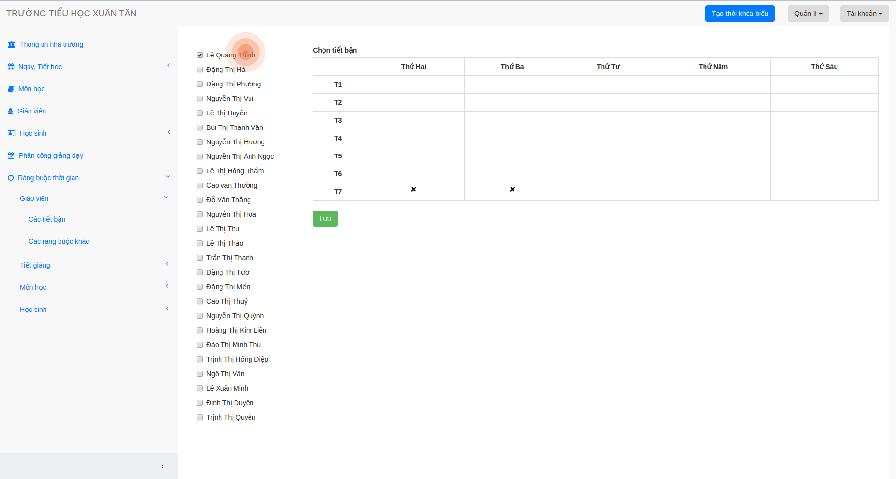
3. Chọn các tiết bận.

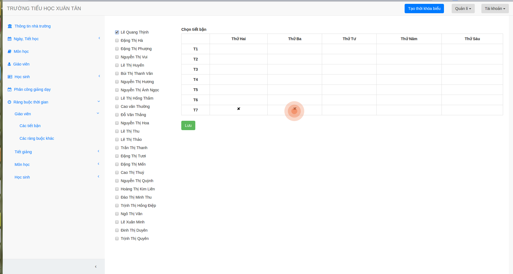
4. Bấm lưu.

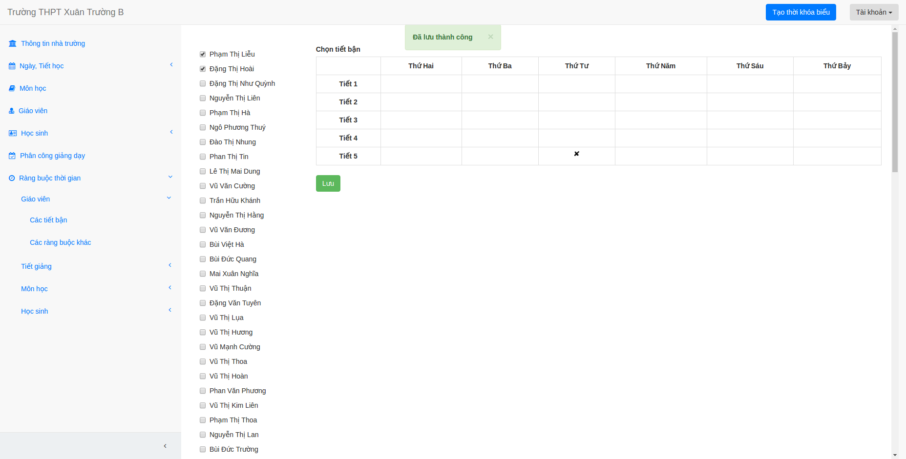
5. Lưu ý: Bạn có thể chọn nhiều giáo viên cùng lúc. Nếu các giáo viên được chọn có các tiết nghỉ khác nhau
thì các ô tích tiết nghỉ trước đó sẽ bị xóa để bạn chọn lại.

## Các ràng buộc khác của giáo viên

1. Chọn "Ràng buộc thời gian" -> "Giáo viên" -> "Các ràng buộc khác".

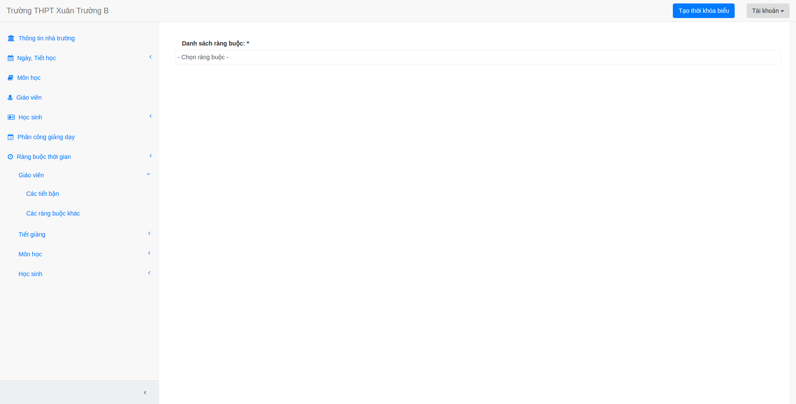
2. Chọn cái ràng buộc trong thanh chọn

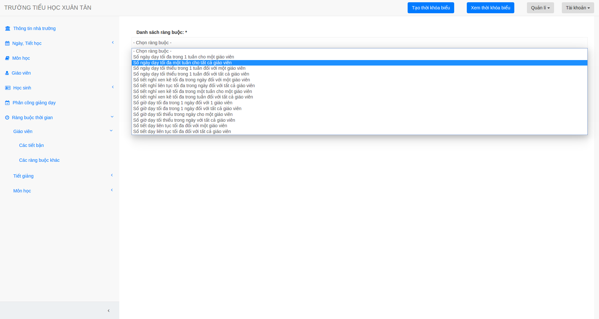
3. Với các ràng buộc cho một giáo viên, ví dụ: "Số ngày dạy tối đa trong tuần cho một giáo viên"
trang web sẽ hiển thị như sau: 

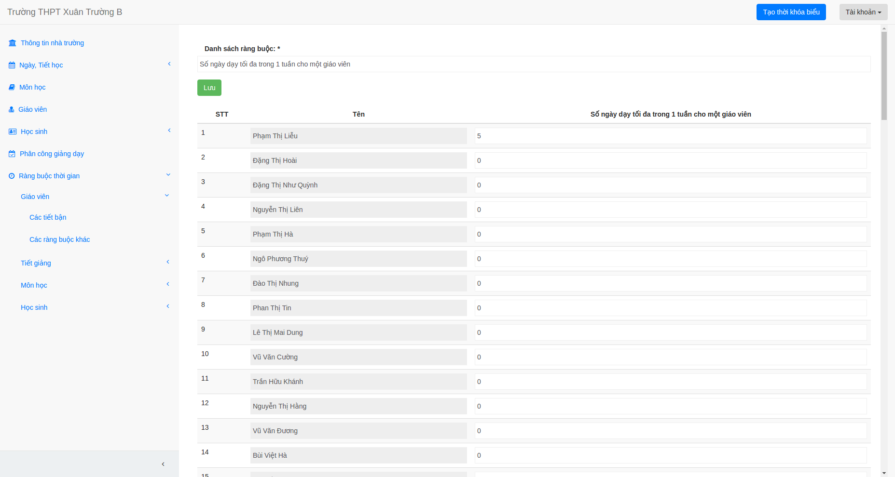
Khi đó, bạn nhập cần ràng buộc cho từng giáo viên, giá trị mặc định sẽ là 0, bạn có thể giữ nguyên nếu không
muốn thay đổi.

4. Nhập xong bạn bấm lưu.

5. Với các ràng buộc cho tất cả các giáo viên trang web sẽ hiển thị như sau:

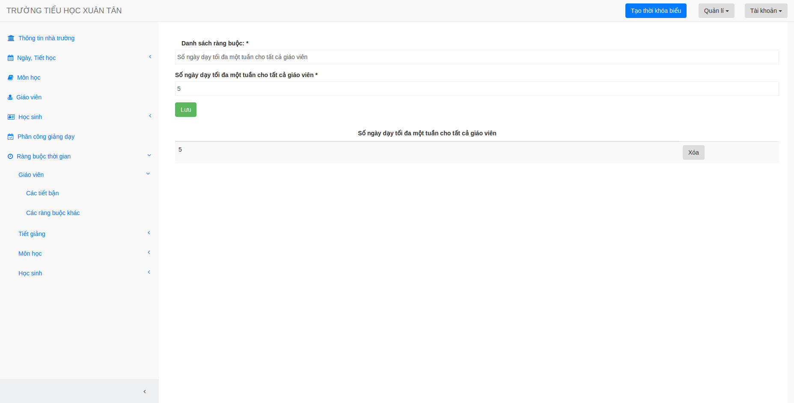
6. Bạn nhập dữ liệu rồi bấm lưu.

## Ràng buộc tiết giảng cố định

1. Bạn chọn "Ràng buộc thời gian" -> "Tiết giảng" -> "Tiết giảng cố định".

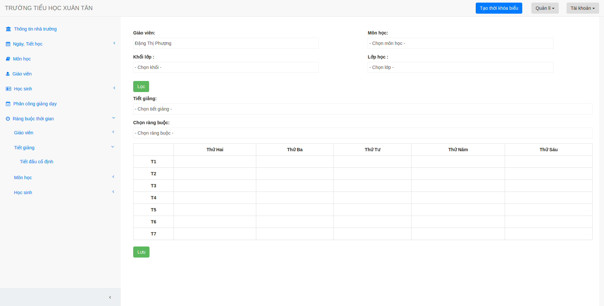
2. Sau đó bạn chọn các thông tin để lọc ra tiết giảng cần chọn

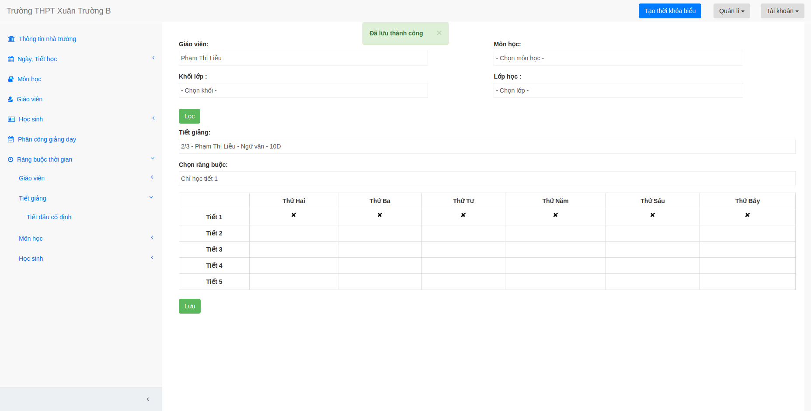
3. Chọn xong bạn bấm lọc, khi đó các tiết giảng được đã được lọc theo đúng yêu cầu

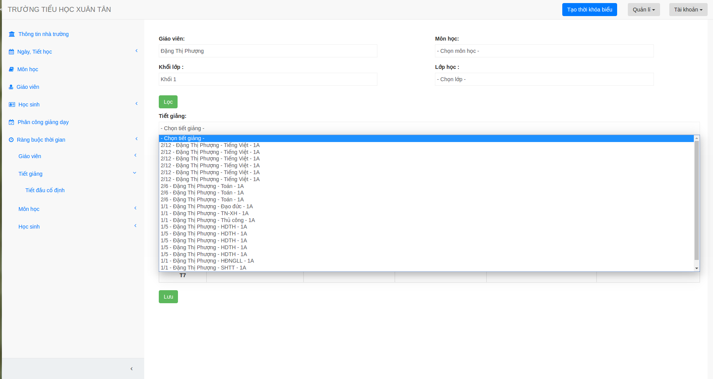
4. Bạn chọn tiết giảng cần thêm ràng buộc rồi lựa chọn các ràng buộc ở bên dưới. Chọn xong bạn nhớ
bấm lưu nhé!

## Ràng buộc tiết cố định với môn học

1. Bạn chọn "Ràng buộc thời gian" -> "Môn học" -> "Tiết cố định".

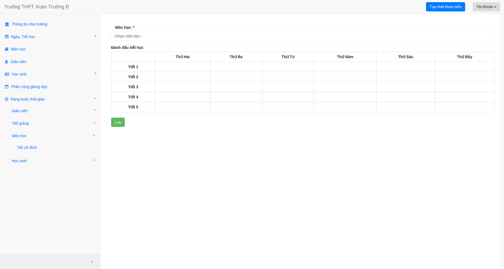
2. Sau đó bạn chọn môn học muốn thêm ràng buộc, tích vào các tiết cố định rồi bấm lưu

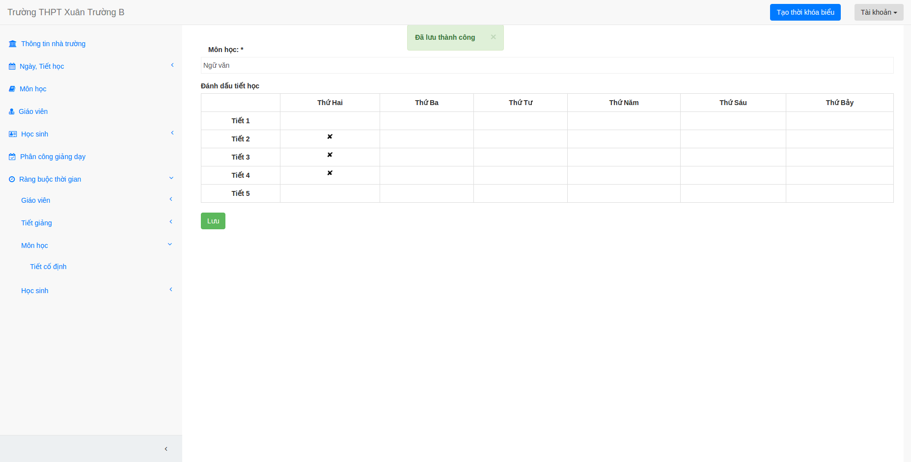

## Ràng buộc tiết nghỉ cố định của từng lớp

1. Bạn chọn "Ràng buộc thời gian" -> "Học sinh" -> "Tiết nghỉ cố định của từng lớp".

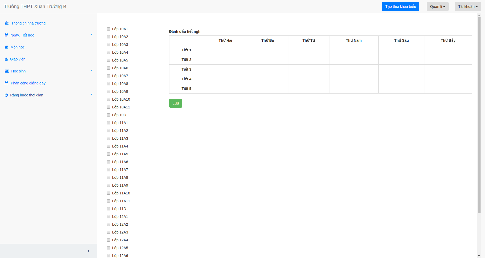

2. Tích vào lớp bạn muốn thêm ràng buộc, bạn có thể chọn nhiều lớp 1 lúc.

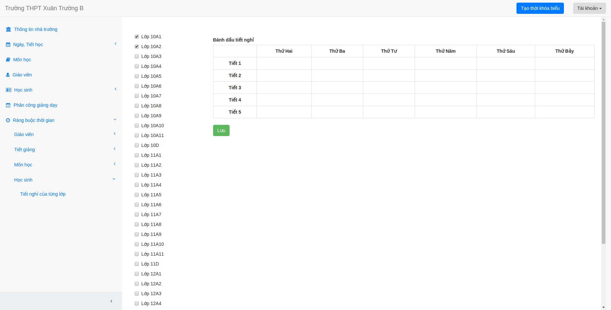
3. Chọn các tiết bận cho lớp đó.

4. Bấm lưu.

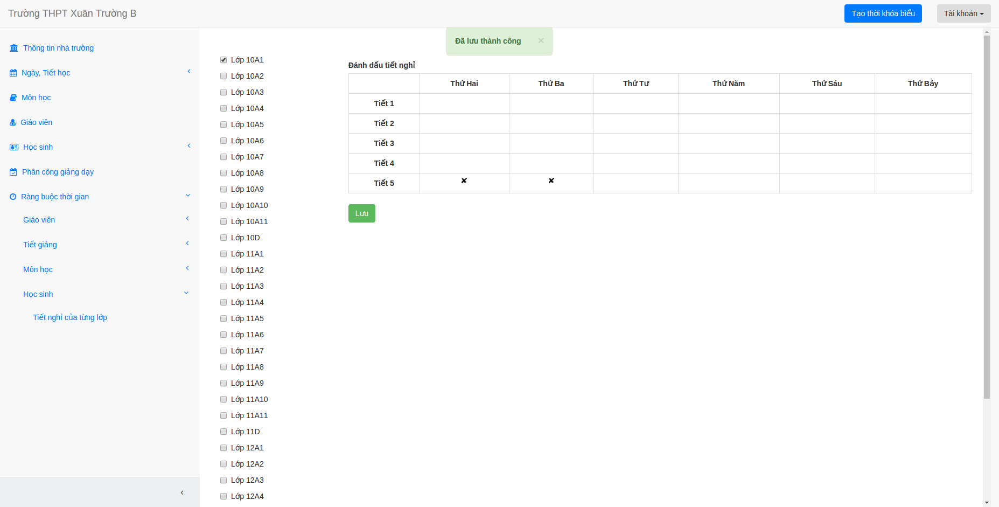
5. Lưu ý: Bạn có thể chọn nhiều lớp cùng lúc. Nếu các lớp được chọn có các tiết nghỉ khác nhau
thì các ô tích tiết nghỉ trước đó sẽ bị xóa để bạn chọn lại.
