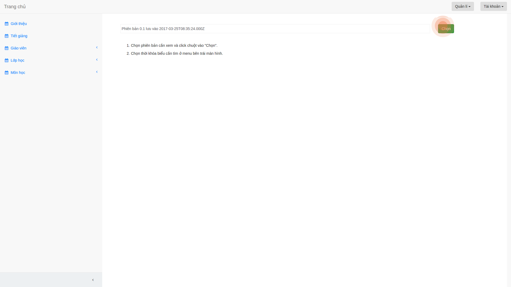
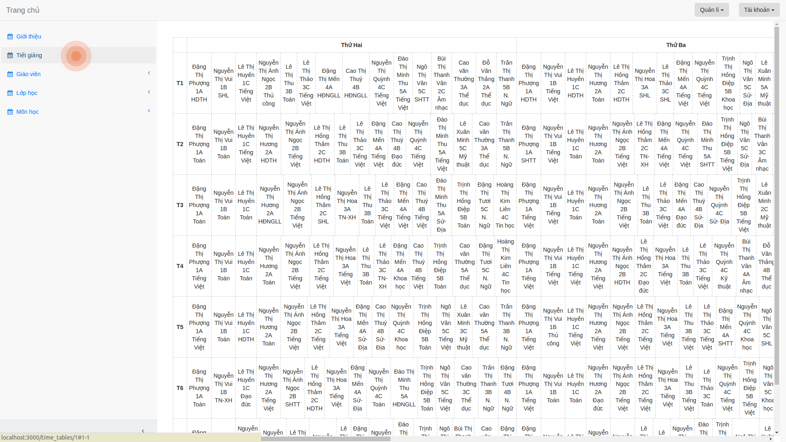

## Tạo thời khóa biểu

1. Sau khi nhập xong dữ liệu, bạn chọn "Tạo thời khóa biểu"

2. Sau đó bạn sẽ được chuyển đến trang xem thời khóa biểu 

3. Tiếp đó bạn chọn phiên bản thời khóa biểu mà bạn cần xem

4. Sau đó bạn chọn các mục như "Tiết giảng", "Giáo viên",... để xem thời khóa biểu

## Xem thời khóa biểu

1. Bạn có thể xem thời khóa biểu đã tạo bằng cách bấm vào "Xem thời khóa biểu"

