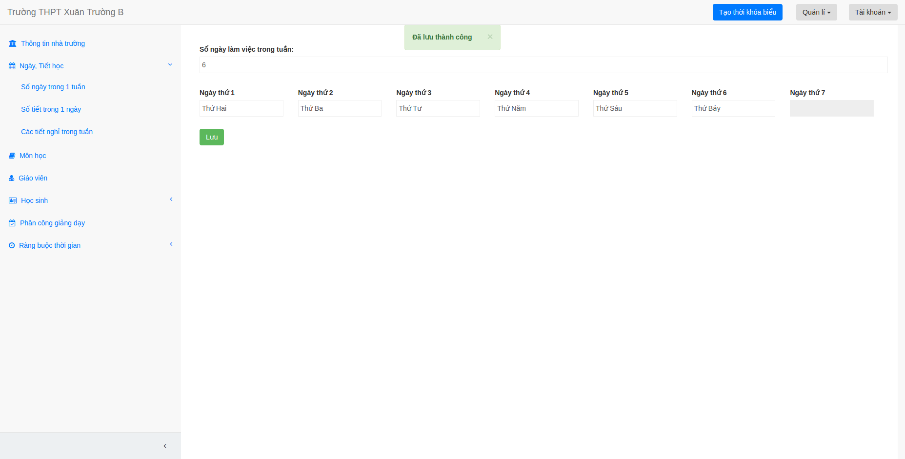
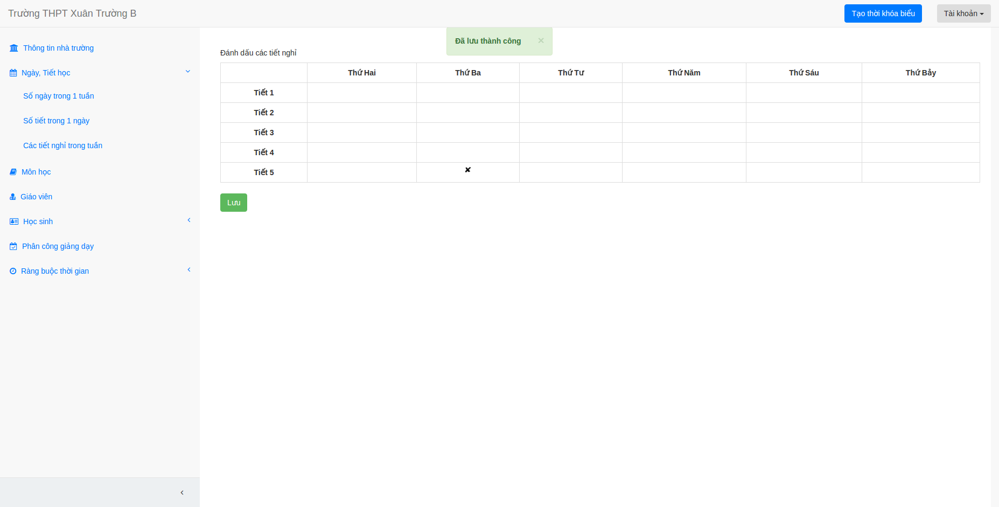

## Nhập số ngày trong một tuần

1. Bạn chọn mục ngày học tiết học, sau đó chọn mục số ngày trong một tuần.

2. Tiếp đó, bạn điền số ngày học trong một tuần, bạn có thể sửa tên các thứ trong tuần nếu muốn.

3. Bấm lưu.

## Nhập số tiết trong một ngày

1. Bạn làm tương tự như nhập số ngày trong một tuần.

## Nhập các tiết nghỉ trong tuần

1. Bạn chọn mục ngày học tiết học, sau đó chọn mục "Các tiết nghỉ trong tuần".

2. Tích vào các tiết nghỉ trong một tuần của cả trường.

3. Bấm lưu.

