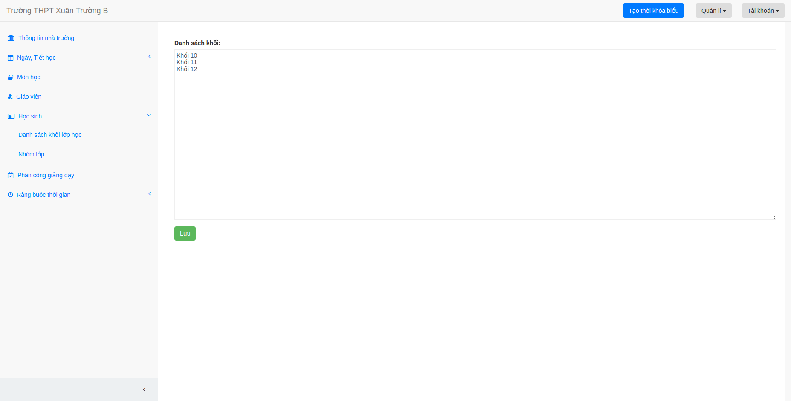
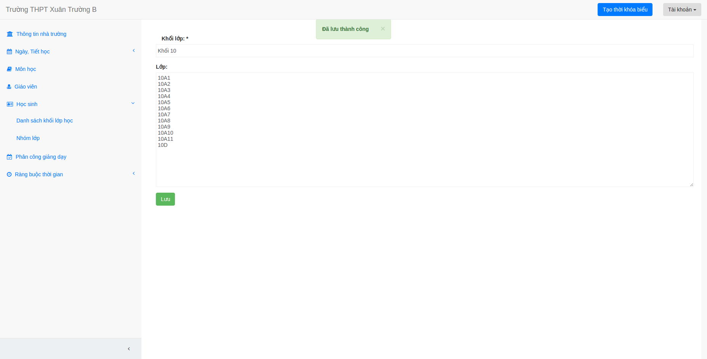

## Nhập danh sách các khối và danh sách lớp học

## Nhập danh sách khối lớp học

1. Chọn mục "Học sinh" rồi chọn  "Danh sách khối lớp học".

2. Nhập danh sách các khối lớp vào ô nhập liệu, nhập xong tên một khối lớp bạn nhớ xuống dòng 
để nhập khối tiếp theo nhé.

3. Bấm lưu.

## Nhập danh sách các nhóm lớp

1. Chọn mục "Học sinh" rồi chọn "Nhóm lớp".

2. Chọn khối lớp.

3. Nhập danh sách các lớp rồi bấm lưu.

