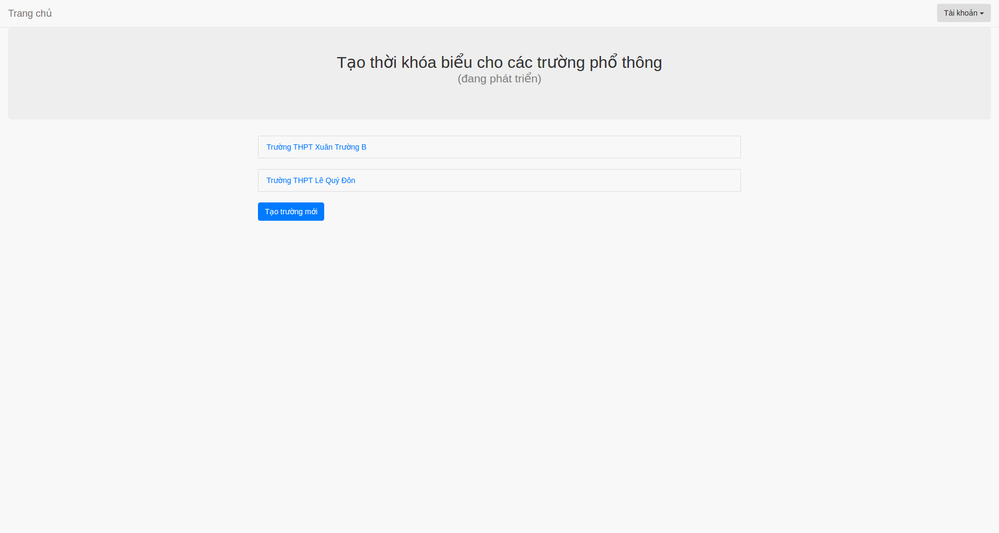

#Hướng dẫn sử dụng phần mềm thời khóa biểu

## Đăng ký
Nếu là lần đầu tiên sử dụng, bạn cần phải đăng ký tài khoản. Để đăng kí tài khoản, bạn làm như sau:

1. Mở trình duyệt Chrome, Cốc Cốc, Firefox hoặc trình duyệt quen thuộc của bạn.
2. Truy cập trang web [http://timetable3.cloudapp.net](http://timetable3.cloudapp.net).
3. Tìm và vào mục [đăng ký](http://timetable3.cloudapp.net/users/sign_up) để đăng ký tài khoản.
4. Nhập thông tin của bạn vào để **Đăng ký**. Hệ thống sẽ gửi một email vào tài khoản bạn đăng ký.
5. Bạn mở e-mail đã đăng ký để tìm và mở thư xác nhận tài khoản. Nếu không thấy thư được gửi, bạn có thể tìm trong hộp Thư rác
6. Bạn đọc thư xác nhận tài khoản và làm theo hướng dẫn là ấn vào liên kết trong thư để xác nhận tài khoản.

Khi xác nhận e-mail xong, bạn đã hoàn thành việc đăng ký thành viên của Timetable. Bây giờ bạn có thể đăng nhập và sử dụng sách.

## Đăng nhập

Nếu bạn đã đăng ký tài khoản sử dụng, bạn làm như sau:

1. Truy cập trang web [http://timetable3.cloudapp.net](http://timetable3.cloudapp.net).
2. Nhập e-mail và mật khẩu đã đăng ký, sau đó ấn **Đăng nhập**.
3. Sau khi đăng nhập lần đầu tiên, màn hình sẽ hiển thị như hình bên dưới. Bạn có thể chọn trường mình đã tạo hoặc tạo một trường mới.

