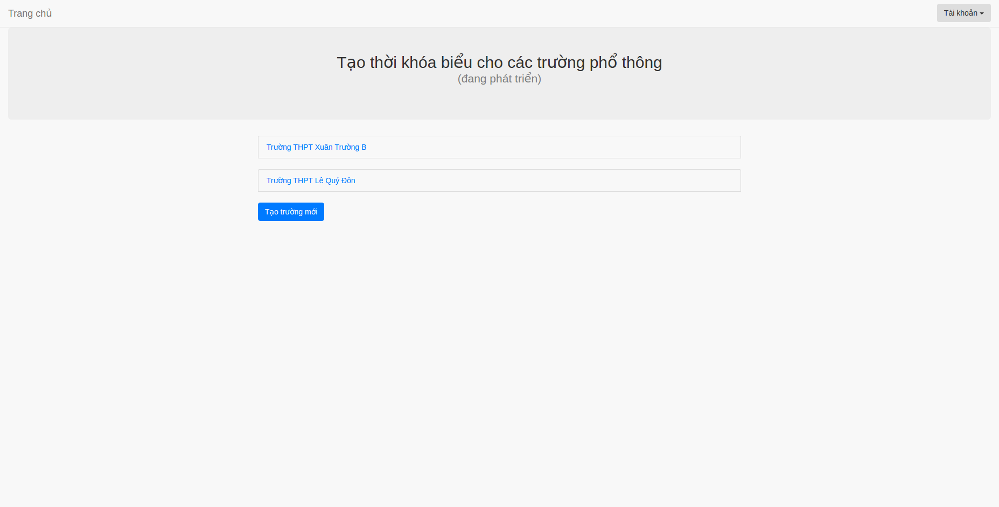
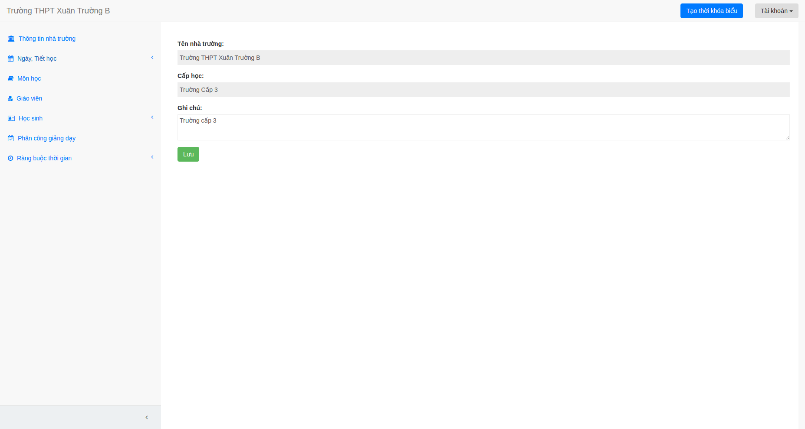

## Tạo thời khóa biểu
Để tạo một thời khóa biểu mới bạn làm như sau:

1. Ấn vào nút **Tạo trường mới**.

2. Chọn cấp học, điền tên trường rồi bấm tạo thời khóa biểu.

3. Tạo xong trường mới bạn cần phải nhập các thông tin để tạo thời khóa biểu như giáo viên, phân công giảng dạy,...

