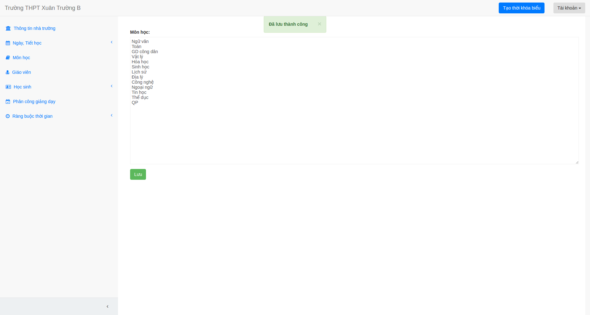
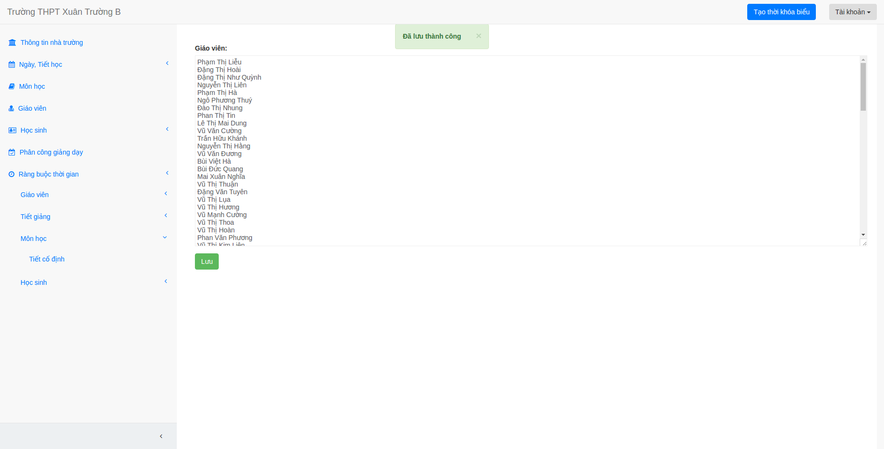

## Nhập môn học

1. Bạn chọn mục Môn học.

2. Nhập danh sách môn học vào ô nhập dữ liệu, bạn nhớ xuống dòng mỗi khi nhập xong tên một môn học nhé.

3. Bấm lưu.

## Nhập danh sách giáo viên

1. Bạn làm tương tự như nhập danh sách môn học.

2. Lưu ý: Tên các giáo viên phải khác nhau.

